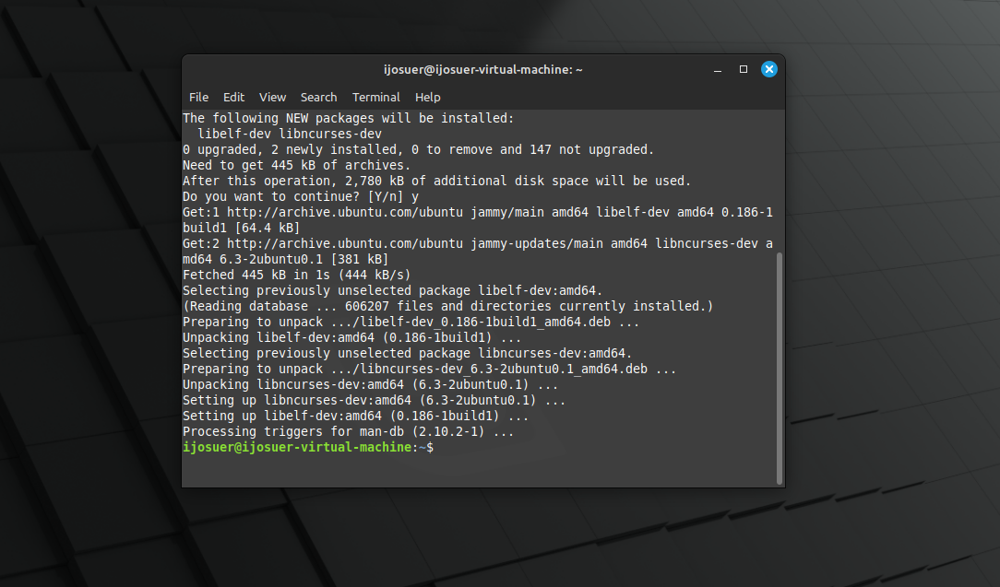
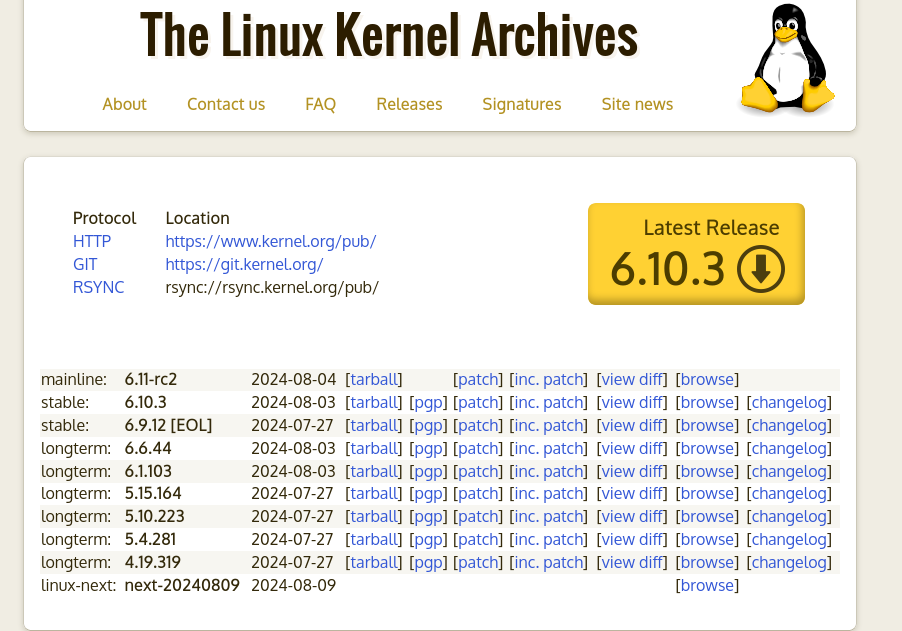
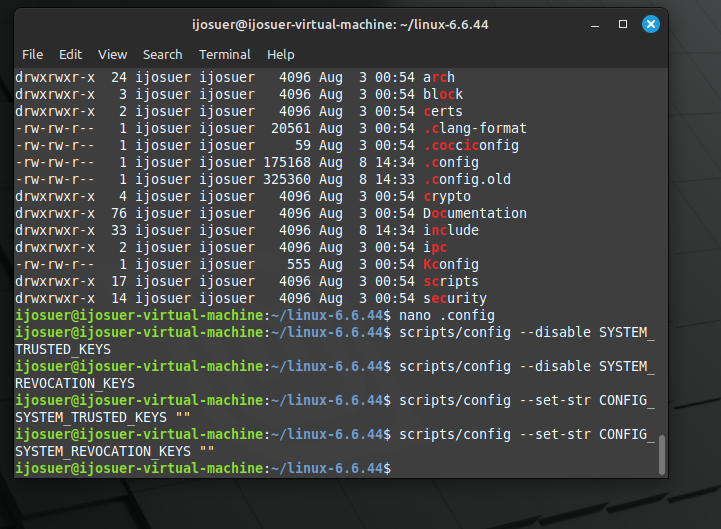
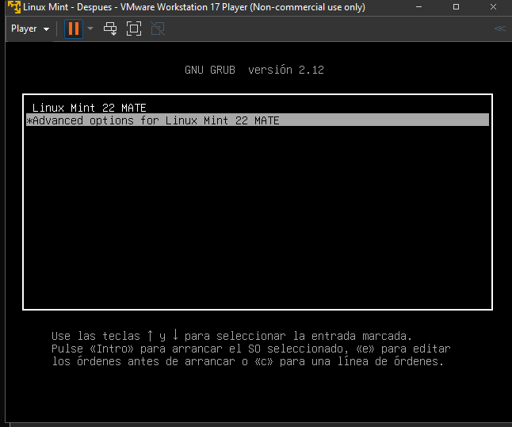
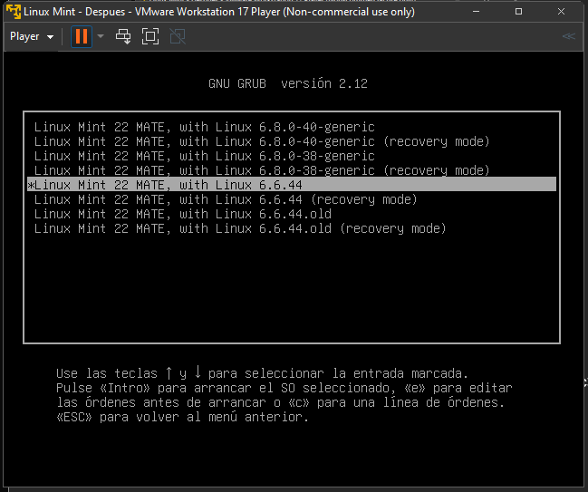

# Cómo compilar e instalar el kernel de Linux

## Instalar dependencias
Primero necesitamos instalar algunos paquetes necesarios para la compilación:

```bash
$ sudo apt install build-essential libncurses-dev bison flex libssl-dev libelf-dev fakeroot dwarves
```


## Descargar y descomprimir el kernel
A continuación, se debe descargar el codigo fuente del kernel desde el sitio web oficial kernel.org. 



Usaremos la version ```longterm``` del kernel (Al meomento de este tutorial era la version 6.6.44).  Copie el enlace del hipervínculo ```tarball```. Luego use este enlace para descargar y descomprimir la fuente del kernel.

```bash
$ wget https://cdn.kernel.org/pub/linux/kernel/v6.x/linux-6.6.44.tar.xz
$ tar -xf linux-6.6.44.tar.xz
```


## Configurar el kernel
Primero ingrasamos al directorio del codigo fuente:

```bash
$ cd linux-6.6.44
```

La configuración del kernel se debe especificar en un archivo .config. Para no escribir este desde 0. Por lo que utilizamos el comando localmodconfig que analiza los módulos del kernel cargados de su sistema y modifica el archivo .config de modo que solo estos módulos se incluyan en la compilación. Tomar en cuenta que esto causará que nuestro kernel compilado solo funcione en nuestra maquina, por lo que si quieren que sea portatil omitan este paso.

Si, al ejecutar el comando anterior, se le solicita algun input, <b>simplemente presionar Enter </b>cada vez (sin escribir una respuesta)
```bash
$ make localmodconfig
```

Luego tenemos que modificar el .config, ya que al copiar nuestro .config se incluyeron nuestras llaves privadas, por lo que tendremos que reliminarlas del .config. <b>Este paso es esencial</b>
```bash
$ scripts/config --disable SYSTEM_TRUSTED_KEYS
$ scripts/config --disable SYSTEM_REVOCATION_KEYS
$ scripts/config --set-str CONFIG_SYSTEM_TRUSTED_KEYS ""
$ scripts/config --set-str CONFIG_SYSTEM_REVOCATION_KEYS ""
```


## Compilar el kernel
Ahora es el momento de compilar el kernel. Para esto simplemente ejecute el comando:

```bash
$ fakeroot make
```

Utilizar ```fakeroot``` es necesario por que nos permite ejecutar el comando ```make``` en  un  entorno  donde  parece  que  se  tiene  permisos  de superusuario  para  la  manipulación  de  ficheros.  Es necesario  para  permitir a este comando crear archivos (tar, ar, .deb etc.) con ficheros con permisos/propietarios de superusuario.

También se puede acelerar la compilación utilizando varios núcleos de CPU. Por ejemplo:
```bash
$ fakeroot make -j4
```
utilizará cuatro núcleos de su computadora.

Para comprobar el estado del proceso al finalizar la compilación, usar el siguiente comando:

```bash
$ echo $?
```
Si se obtiene un `'0'` el estado es correcto, cualquier número distino significa que ocurrio un `ERROR`

## Instalar el kernel
La instalación se divide en dos partes: instalar los módulos del kernel e instalar el kernel mismo.

Primero se instalan los módulos del kernel ejecutando:
```bash
$ sudo make modules_install
```

Luego instalamos el kernel:
```bash
$ sudo make install
```

Después de eso, reiniciamos la computadora para que se complete la instalación.
```bash
$ sudo reboot
```

## Elegir Kernel desde GRUB
Si se está utilizando el virtualizador `VMware` presionar la combinacion de teclas <b>`SHIFT+ESC`</b> al arrancar la maquina virtual, para desplegar el GRUB



Seleccionar el Kernel correspondiente en `Advanced Options`



Existen distintos metodos para agregar el kernel al grub de manera predeterminada. Vía comandos `bash` o modificando el archivo `/boot/grub/grub.cfg`.